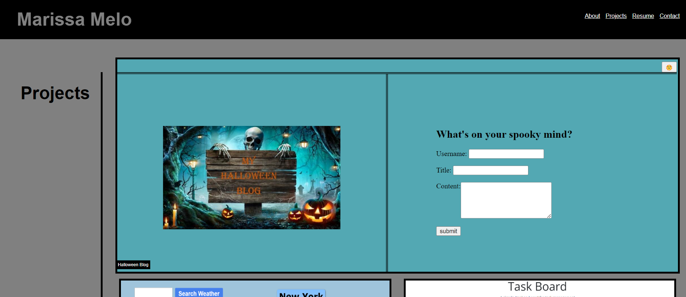

# React + Vite

## Description
Welcome to my portfolio! This project is built with React and Vite, showcasing my skills and projects in a modern and efficient way.

## Getting Started
1. Clone the repository
2. Install dependencies: npm install
3. Start the development serve: npm run dev

## Scripts
1. npm run dev: Start the development server.
2. npm run build: Build the project for production.
3. npm run preview: Preview the production build locally.

## Tech Stack
React: A JavaScript library for building user interfaces.
Vite: A fast build tool and development server.
CSS Modules or Styled Components: For styling components.
React Router: For client-side routing.

## Screenshots

## Contact
Feel free to reach out to me if you have any questions or feedback!
Email: marissa.melo91@yahoo.com
GitHub: https://github.com/marissamelo91

